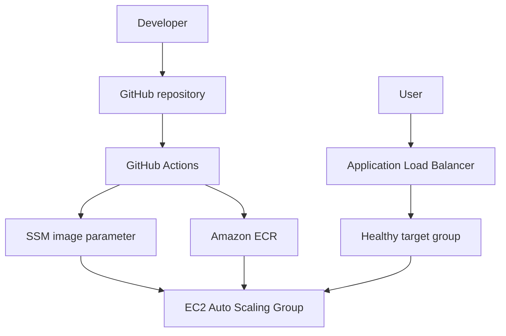
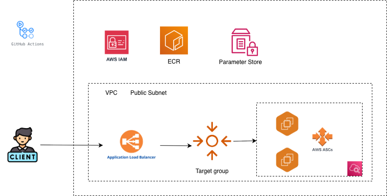
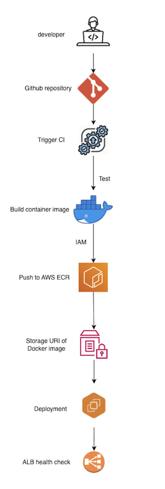

# Golden Owl DevOps Internship Challenge

A containerized Node.js application with automated CI/CD using GitHub Actions,
Amazon ECR, AWS EC2 Auto Scaling, an Application Load Balancer, AWS Systems
Manager Parameter Store, and Terraform.

## Live Application

**Development endpoint:**
[http://goldenowl-devops-1322176295.ap-southeast-1.elb.amazonaws.com](http://goldenowl-devops-1322176295.ap-southeast-1.elb.amazonaws.com)

Expected response:

```json
{
  "message": "Welcome warriors to Golden Owl!"
}
```

Verify the endpoint:

```bash
curl http://goldenowl-devops-1322176295.ap-southeast-1.elb.amazonaws.com
```

## Architecture



Runtime request flow:

```text
Client → ALB:80 → Target Group → EC2:3000 → Docker container → Node.js
```

The Application Load Balancer distributes requests across healthy EC2 targets.
The EC2 instances are created by an Auto Scaling Group and run the immutable
Docker image referenced by AWS Systems Manager Parameter Store.

### AWS Architecture



The AWS request and deployment paths are intentionally separated:

- **Request path:** Internet traffic enters the public ALB on port 80. The ALB
  forwards requests only to healthy Auto Scaling instances on port 3000.
- **Deployment path:** GitHub Actions assumes the deployment IAM role through
  OIDC, pushes an immutable image to ECR, updates the image URI in Parameter
  Store, and starts an Auto Scaling instance refresh.
- **Instance bootstrap path:** Each new EC2 instance uses its instance role to
  read the current image URI, authenticate to ECR, pull the image, and start the
  Node.js container.
- **Network isolation:** The application Security Group accepts port 3000 only
  from the ALB Security Group. SSH port 22 is not exposed.
- **Availability and scaling:** The ASG maintains two instances under normal
  conditions and can scale to four based on average CPU utilization.

## Branch Strategy

Changes are promoted through the following branches:

```text
feature/** → dev → staging → production
```

| Event or branch | Quality checks | Build and push image | Deploy |
|---|:---:|:---:|:---:|
| Push to `feature/**` | Yes | No | No |
| Push to `dev` with changes in `src/` | Yes | Yes | Development |
| Push to `staging` with changes in `src/` | Yes | Yes | Not configured |
| Push to `production` with changes in `src/` | Yes | Yes | Not configured |
| Pull request to `master`, `dev`, `staging`, or `production` | Yes | No | No |

Every push to `feature/**` automatically runs the CI tests, which directly
satisfies the challenge requirement for feature-branch validation.

The current AWS infrastructure is used as the **development deployment
environment**. The `staging` and `production` branches are validated and can
publish branch-specific images, but dedicated infrastructure for these two
environments has not been provisioned. This prevents multiple branches from
overwriting the same Auto Scaling Group and application endpoint.

## CI/CD Pipeline



### Continuous Integration

The `test` job:

1. Checks out the complete Git history required for change detection.
2. Detects whether files under `src/` changed between the previous and current
   commit.
3. Installs the locked dependency tree with `npm ci`.
4. Runs ESLint.
5. Runs the Prettier format check.
6. Runs the Jest tests.

Quality checks always run for configured feature pushes and pull requests.
Docker build and deployment jobs are skipped when only documentation, workflow,
or Terraform files change.

### Container build

For pushes to `dev`, `staging`, or `production` where `src/` changed, GitHub
Actions:

1. Authenticates to AWS using GitHub OIDC.
2. Logs in to Amazon ECR.
3. Converts the branch name to a Docker-compatible value.
4. Builds a Linux AMD64 Docker image for the EC2 instances.
5. Pushes the immutable image to ECR.

Images use the following tag format:

```text
<branch>-<12-character-commit-ID>
```

Examples:

```text
dev-815db0912345
staging-a41d5f86c120
production-b06ac471d802
```

Full image URI example:

```text
315219809073.dkr.ecr.ap-southeast-1.amazonaws.com/goldenowl-devops:dev-815db0912345
```

The image also contains OCI labels pointing to the complete Git commit SHA and
source repository.

### Development deployment

Only a push to `dev` can start the current deployment job. After a successful
image build, GitHub Actions:

1. Writes the new full image URI to `/goldenowl-devops/image-uri` in Parameter
   Store.
2. Starts an Auto Scaling instance refresh.
3. Waits for the refresh to finish.
4. Allows the ALB health checks to validate new instances before old instances
   are replaced.
5. Sends a request to the public endpoint and verifies the expected message.

Instance refresh preferences keep 100% healthy capacity and allow up to 150%
temporary capacity during the rollout. New instances receive 120 seconds of
warm-up time to install/start Docker, pull the image, and pass health checks.

## Infrastructure

Terraform provisions the following AWS resources in `ap-southeast-1`:

- Amazon ECR private repository and lifecycle policy
- GitHub Actions OIDC provider and deployment IAM role
- EC2 instance role and instance profile
- AWS Systems Manager image parameter
- Application Load Balancer and HTTP listener
- Target Group with HTTP health checks
- Separate ALB and application Security Groups
- EC2 Launch Template
- EC2 Auto Scaling Group
- CPU target-tracking scaling policy
- Encrypted EBS root volumes

### Auto Scaling configuration

| Setting | Value |
|---|---:|
| Minimum capacity | 2 |
| Desired capacity | 2 |
| Maximum capacity | 4 |
| Target CPU utilization | 50% |
| Instance type | `t3.micro` |
| Instance refresh minimum healthy | 100% |
| Instance refresh maximum healthy | 150% |
| Instance warm-up | 120 seconds |

## Security Decisions

- GitHub Actions assumes an AWS IAM role through OIDC and receives temporary
  credentials.
- No long-lived AWS access keys are stored in GitHub Secrets.
- The OIDC trust policy is restricted to this repository and its configured
  branches.
- EC2 instances do not expose SSH port 22.
- The application instances accept port 3000 only from the ALB Security Group.
- The ALB exposes HTTP port 80 to clients.
- EC2 instances use an IAM role to read the image parameter and pull private
  images from ECR.
- ECR image tags are immutable and traceable to a branch and Git commit.
- ECR image scanning, encryption, and lifecycle cleanup are enabled.
- EBS root volumes are encrypted and EC2 requires Instance Metadata Service v2.
- AWS Systems Manager is used for instance administration and diagnostics
  instead of public SSH access.
- The application container runs as the non-root `node` user.

## Repository Structure

```text
.
├── .github/
│   └── workflows/
│       └── ci.yml
├── docs/
│   └── screenshots/
├── iac/
│   ├── autoscaling.tf
│   ├── ec2.tf
│   ├── ecr.tf
│   ├── iam.tf
│   ├── outputs.tf
│   ├── provider.tf
│   ├── user_data.sh.tftpl
│   ├── variables.tf
│   └── versions.tf
├── src/
│   ├── Dockerfile
│   ├── index.js
│   ├── package.json
│   ├── package-lock.json
│   ├── routes/
│   ├── server/
│   └── tests/
├── .gitignore
└── README.md
```

Local Terraform state, variable values, and downloaded providers are excluded
from Git:

```text
iac/terraform.tfstate
iac/terraform.tfstate.backup
iac/terraform.tfvars
iac/.terraform/
```

The provider lock file `iac/.terraform.lock.hcl` is committed for repeatable
provider installation.

## Run Locally

Requirements:

- Node.js `20.20.2`
- npm

Install dependencies and run all checks:

```bash
cd src
npm ci
npm run lint:check
npm run format:check
npm test
npm start
```

In another terminal, verify the application:

```bash
curl http://localhost:3000
```

## Run with Docker

Build the image for the local machine architecture:

```bash
docker build -t goldenowl-devops:local ./src
```

Run the container:

```bash
docker run --rm \
  --name goldenowl-app \
  -p 3000:3000 \
  goldenowl-devops:local
```

Verify:

```bash
curl http://localhost:3000
```

The GitHub Actions build explicitly uses `linux/amd64` because the current EC2
instance type uses the x86-64 architecture. On an Apple Silicon machine, an
AMD64 test image can be run through Docker emulation by specifying
`--platform linux/amd64`.

## Terraform Usage

Requirements:

- Terraform compatible with the constraint in `iac/versions.tf`
- AWS credentials with permission to manage the declared resources
- AWS region `ap-southeast-1`
- An existing bootstrap image in the ECR repository

Initialize Terraform:

```bash
terraform -chdir=iac init
```

Format and validate the configuration:

```bash
terraform -chdir=iac fmt -check
terraform -chdir=iac validate
```

Preview changes:

```bash
terraform -chdir=iac plan
```

Apply the infrastructure:

```bash
terraform -chdir=iac apply
```

Display Terraform outputs:

```bash
terraform -chdir=iac output
terraform -chdir=iac output -raw application_url
```

### Bootstrap image

The initial Auto Scaling instances need an image that already exists in ECR.
The uncommitted `iac/terraform.tfvars` file therefore supplies an existing
image tag, for example:

```hcl
image_tag = "dev-815db0912345"
```

Terraform uses this tag to create the initial image URI in Parameter Store.
After bootstrapping, GitHub Actions owns the parameter value during application
deployments and updates it before every development instance refresh.

## Verification

The submission includes the following deployment evidence:


Additional verification commands:

```bash
terraform -chdir=iac output
curl http://goldenowl-devops-1322176295.ap-southeast-1.elb.amazonaws.com
```

## Current Scope and Future Improvements

The current deployment uses one AWS environment as the development target.
Possible next steps include:

- Provision isolated development, staging, and production Terraform stacks.
- Promote the same immutable image digest between environments instead of
  rebuilding it on every environment branch.
- Add HTTPS using Route 53 and AWS Certificate Manager.
- Place EC2 instances in private subnets and keep only the ALB public.
- Store Terraform state in an encrypted remote backend with locking.
- Add centralized CloudWatch logs, metrics, alarms, and automated rollback.
- Add an explicit `/healthz` endpoint and container/image security gates.
- Upgrade the Node.js runtime and dependencies after compatibility and
  vulnerability testing.

## Cleanup

After the assessment has been reviewed, destroy the infrastructure to stop
ongoing charges:

```bash
terraform -chdir=iac destroy
```

The ECR repository must be empty before it can be destroyed because force
deletion is intentionally disabled. Do not destroy the live environment before
the reviewer has completed the assessment.