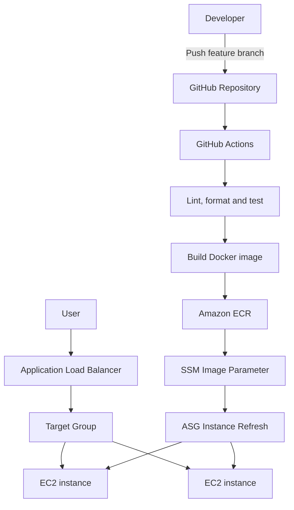
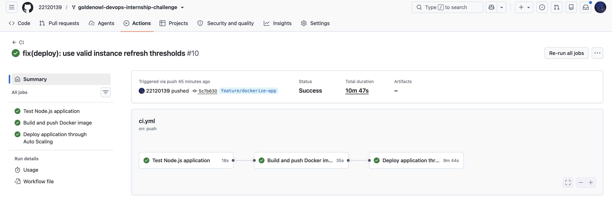
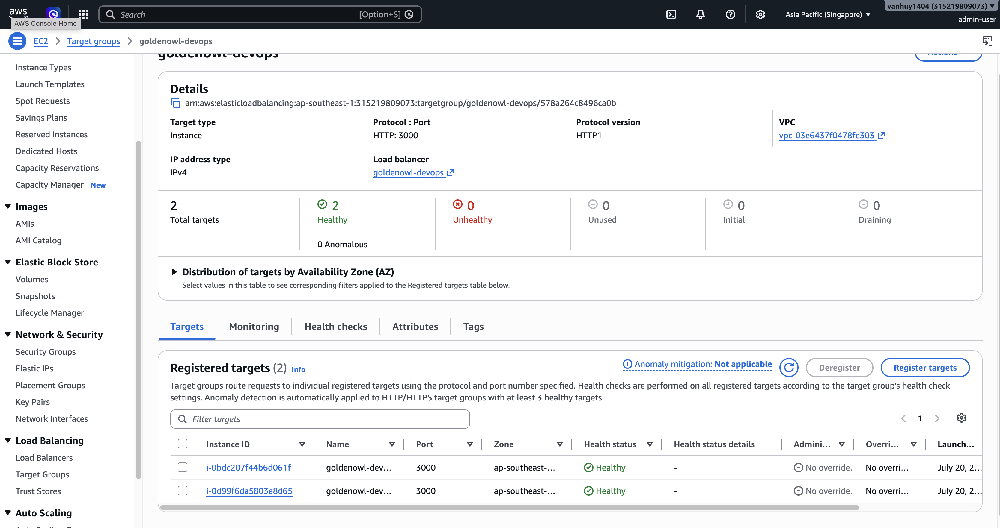
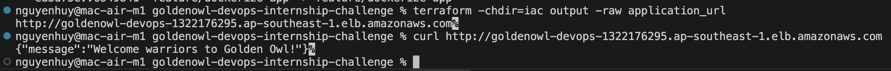

# Golden Owl DevOps Internship Challenge

A containerized Node.js application with an automated CI/CD pipeline using GitHub Actions, Amazon ECR, AWS EC2 Auto Scaling, Application Load Balancer, AWS Systems Manager, and and Terraform.

## Live Application

**Endpoint:** http://goldenowl-devops-1322176295.ap-southeast-1.elb.amazonaws.com

Expected response:

```json
{
  "message": "Welcome warriors to Golden Owl!"
}
```

Test the endpoint:

```bash
curl http://goldenowl-devops-1322176295.ap-southeast-1.elb.amazonaws.com
```

## Architecture



## CI/CD Flow

```mermaid
flowchart LR
    Push["Push feature branch"] --> Quality["Lint, format, test"]
    Quality --> Docker["Build Docker image"]
    Docker --> Registry["Push to Amazon ECR"]
    Registry --> Update["Update SSM Parameter"]
    Update --> Rolling["Start Instance Refresh"]
    Rolling --> Health["ALB health checks"]
    Health --> Verify["Verify public endpoint"]
```



The pipeline follows this sequence:

1. A commit is pushed to a `feature/**` branch.
2. GitHub Actions installs dependencies using `npm ci`.
3. ESLint, Prettier, and Jest checks are executed.
4. A production Docker image is built.
5. The image is tagged with the full Git commit SHA.
6. GitHub authenticates to AWS through OIDC.
7. The immutable image is pushed to Amazon ECR.
8. The image URI in AWS Systems Manager Parameter Store is updated.
9. An Auto Scaling instance refresh replaces the instances gradually.
10. The Application Load Balancer routes traffic only to healthy targets.
11. GitHub Actions verifies the public endpoint.

## Infrastructure

Terraform provisions:

- Amazon ECR private repository
- GitHub Actions OIDC identity provider
- Least-privilege IAM roles
- Application Load Balancer
- Target Group with HTTP health checks
- EC2 Launch Template
- Auto Scaling Group
- CPU target-tracking scaling policy
- AWS Systems Manager Parameter Store
- Security Groups
- Encrypted EBS volumes

### Auto Scaling configuration

| Setting | Value |
|---|---:|
| Minimum capacity | 2 |
| Desired capacity | 2 |
| Maximum capacity | 4 |
| Target CPU utilization | 50% |
| Instance type | `t3.micro` |
| Instance refresh minimum healthy | 100% |
| Instance refresh maximum healthy | 150% |

## Security Decisions

- GitHub Actions authenticates to AWS using OIDC and temporary credentials.
- No long-lived AWS access keys are stored in GitHub Secrets.
- EC2 instances do not expose SSH port 22.
- Application instances accept port 3000 only from the ALB Security Group.
- The ALB exposes only HTTP port 80.
- EC2 instances use IAM roles to pull images from ECR.
- ECR tags are immutable and use Git commit SHAs.
- ECR scans images after they are pushed.
- EBS volumes are encrypted.
- EC2 Instance Metadata Service v2 is required.
- IAM policies are scoped to the required ECR repository and deployment resources.

## Repository Structure

```text
.
├── .github/
│   └── workflows/
│       └── ci.yml
├── docs/
│   └── screenshots/
├── iac/
│   ├── autoscaling.tf
│   ├── ec2.tf
│   ├── ecr.tf
│   ├── iam.tf
│   ├── outputs.tf
│   ├── provider.tf
│   ├── user_data.sh.tftpl
│   ├── variables.tf
│   └── versions.tf
├── src/
│   ├── Dockerfile
│   ├── index.js
│   ├── package.json
│   ├── package-lock.json
│   ├── routes/
│   ├── server/
│   └── tests/
├── .gitignore
└── README.md
```

## Run Locally

```bash
cd src
npm ci
npm test
npm start
```

Test the application:

```bash
curl http://localhost:3000
```

## Run with Docker

Build the image:

```bash
docker build -t goldenowl-devops:local ./src
```

Run the container:

```bash
docker run --rm \
  --name goldenowl-app \
  -p 3000:3000 \
  goldenowl-devops:local
```

Verify:

```bash
curl http://localhost:3000
```

## Terraform Usage

Initialize Terraform:

```bash
terraform -chdir=iac init
```

Format and validate:

```bash
terraform -chdir=iac fmt -check
terraform -chdir=iac validate
```

Preview infrastructure changes:

```bash
terraform -chdir=iac plan
```

Apply infrastructure:

```bash
terraform -chdir=iac apply
```

Display the application endpoint:

```bash
terraform -chdir=iac output application_url
```

The local `terraform.tfvars` file must define an existing ECR image tag:

```hcl
image_tag = "full-40-character-git-commit-sha"
```

## Branch Strategy

Continuous integration is triggered for branches matching:

```text
feature/**
```

Pull requests targeting `master` also run the quality checks.

Docker images use the full Git commit SHA:

```text
315219809073.dkr.ecr.ap-southeast-1.amazonaws.com/goldenowl-devops:<commit-sha>
```

## Deployment Strategy

The deployment uses rolling instance replacement:

1. GitHub Actions updates the image URI in Parameter Store.
2. GitHub Actions starts an Auto Scaling instance refresh.
3. A new EC2 instance starts and reads the image URI.
4. The instance pulls and runs the corresponding image.
5. The ALB marks the new target healthy.
6. Auto Scaling terminates an old instance.
7. The process repeats until all instances run the new image.

This approach maintains healthy capacity during deployment.

## Verification







## Cleanup

After the assessment has been reviewed, destroy the infrastructure to stop ongoing charges:

```bash
terraform -chdir=iac destroy
```

The ECR repository must be empty before it can be destroyed because force deletion is intentionally disabled.